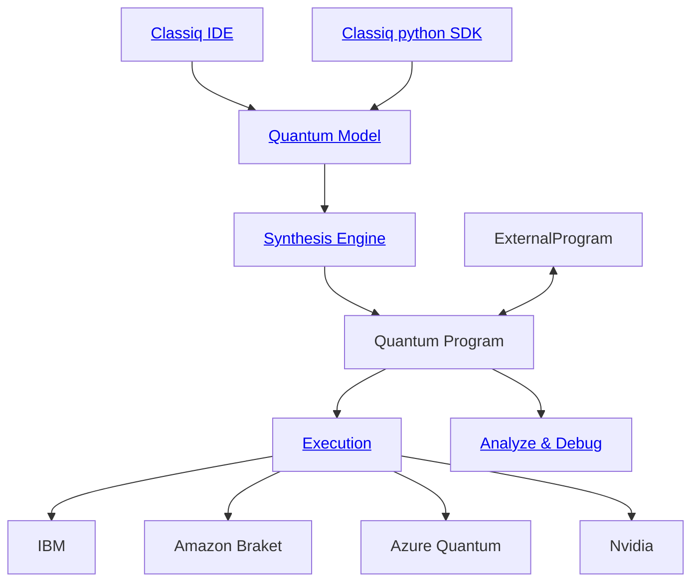

<!DOCTYPE html><html lang="en"><head>
    <meta charset="UTF-8"/>
    <meta name="viewport" content="width=device-width, initial-scale=1.0"/>
    <title>The Future of Quantum Annealing: Novel Methods and Theoretical Frontiers</title>
    <script src="https://cdn.tailwindcss.com"></script>
    <script src="https://cdn.jsdelivr.net/npm/three@0.155.0/build/three.min.js"></script>
    <script src="https://cdn.jsdelivr.net/npm/vanta@latest/dist/vanta.net.min.js"></script>
    <link href="https://fonts.googleapis.com/css2?family=Playfair+Display:ital,wght@0,400;0,600;0,700;1,400&amp;family=Inter:wght@300;400;500;600;700&amp;display=swap" rel="stylesheet"/>
    <link rel="stylesheet" href="https://cdnjs.cloudflare.com/ajax/libs/font-awesome/6.4.0/css/all.min.css"/>
    <style>
        :root {
            --primary: #1e3a8a;
            --secondary: #64748b;
            --accent: #0ea5e9;
            --neutral: #f8fafc;
            --base-100: #ffffff;
            --base-content: #1e293b;
        }
        
        body {
            font-family: 'Inter', sans-serif;
            color: var(--base-content);
            line-height: 1.7;
            overflow-x: hidden;
        }
        
        .serif {
            font-family: 'Playfair Display', serif;
        }
        
        .hero-bg {
            background: linear-gradient(135deg, rgba(30, 58, 138, 0.9), rgba(14, 165, 233, 0.8));
        }
        
        .toc-fixed {
            position: fixed;
            left: 0;
            top: 0;
            height: 100vh;
            width: 280px;
            background: rgba(248, 250, 252, 0.95);
            backdrop-filter: blur(10px);
            border-right: 1px solid #e2e8f0;
            z-index: 1000;
            overflow-y: auto;
            padding: 2rem 1.5rem;
        }
        
        .main-content {
            margin-left: 280px;
            min-height: 100vh;
        }
        
        .hero-section {
            height: 60vh;
            position: relative;
            overflow: hidden;
        }
        
        .bento-grid {
            display: grid;
            grid-template-columns: 2fr 1fr;
            grid-template-rows: auto auto;
            gap: 2rem;
            height: 100%;
        }
        
        .bento-main {
            grid-row: 1 / 3;
            display: flex;
            flex-direction: column;
            justify-content: center;
            position: relative;
            z-index: 10;
        }
        
        .bento-side {
            display: flex;
            flex-direction: column;
            gap: 1rem;
        }
        
        .citation-link {
            color: var(--accent);
            text-decoration: none;
            font-weight: 500;
            border-bottom: 1px dotted var(--accent);
            transition: all 0.2s ease;
        }
        
        .citation-link:hover {
            background-color: rgba(14, 165, 233, 0.1);
            border-bottom: 1px solid var(--accent);
        }
        
        .section-card {
            background: white;
            border-radius: 12px;
            padding: 2.5rem;
            box-shadow: 0 4px 6px -1px rgba(0, 0, 0, 0.1);
            margin-bottom: 3rem;
            border: 1px solid #e2e8f0;
        }
        
        .highlight-box {
            background: linear-gradient(135deg, #eff6ff, #dbeafe);
            border-left: 4px solid var(--accent);
            padding: 1.5rem;
            margin: 1.5rem 0;
            border-radius: 0 8px 8px 0;
        }
        
        .pull-quote {
            font-size: 1.25rem;
            font-style: italic;
            color: var(--primary);
            border-left: 3px solid var(--accent);
            padding-left: 1.5rem;
            margin: 2rem 0;
            background: #f8fafc;
            padding: 1.5rem;
            border-radius: 0 8px 8px 0;
        }
        
        @media (max-width: 1024px) {
            .toc-fixed {
                transform: translateX(-100%);
                transition: transform 0.3s ease;
            }
            
            .toc-fixed.open {
                transform: translateX(0);
            }
            
            .main-content {
                margin-left: 0;
            }
            
            .bento-grid {
                grid-template-columns: 1fr;
                grid-template-rows: auto auto auto;
            }
            
            .bento-main {
                grid-row: 1;
            }
        }

        @media (max-width: 768px) {
            .hero-section {
                height: auto;
                min-height: 50vh;
                padding: 2rem 0;
            }
            
            .bento-main h1 {
                font-size: 2.5rem;
                line-height: 1.2;
            }
            
            .bento-main p {
                font-size: 1rem;
            }
            
            .bento-side .section-card {
                padding: 1rem;
            }
        }
    </style>
  </head>

  <body class="bg-slate-50">
    <!-- Table of Contents -->
    <nav class="toc-fixed" id="toc">
      <div class="mb-6">
        <h3 class="text-lg font-semibold text-slate-800 mb-4">Contents</h3>
      </div>
      <ul class="space-y-3 text-sm">
        <li>
          <a href="#executive-summary" class="block text-slate-600 hover:text-blue-600 transition-colors">Executive Summary</a>
        </li>
        <li>
          <a href="#enhancing-performance" class="block text-slate-600 hover:text-blue-600 transition-colors">1. Enhancing Performance</a>
          <ul class="ml-4 mt-2 space-y-2">
            <li>
              <a href="#rfqa" class="block text-slate-500 hover:text-blue-500 transition-colors">1.1 Random-Frequency QA</a>
            </li>
            <li>
              <a href="#adaptive-trotterization" class="block text-slate-500 hover:text-blue-500 transition-colors">1.2 Adaptive Trotterization</a>
            </li>
            <li>
              <a href="#direct-pubo" class="block text-slate-500 hover:text-blue-500 transition-colors">1.3 Direct PUBO</a>
            </li>
          </ul>
        </li>
        <li>
          <a href="#new-architectures" class="block text-slate-600 hover:text-blue-600 transition-colors">2. New Architectures</a>
          <ul class="ml-4 mt-2 space-y-2">
            <li>
              <a href="#parityqc" class="block text-slate-500 hover:text-blue-500 transition-colors">2.1 ParityQC/LHZ</a>
            </li>
            <li>
              <a href="#ising-wires" class="block text-slate-500 hover:text-blue-500 transition-colors">2.2 Ising Quantum Wires</a>
            </li>
            <li>
              <a href="#clique-embedding" class="block text-slate-500 hover:text-blue-500 transition-colors">2.3 Maximum Clique</a>
            </li>
          </ul>
        </li>
        <li>
          <a href="#hybrid-approaches" class="block text-slate-600 hover:text-blue-600 transition-colors">3. Hybrid Approaches</a>
          <ul class="ml-4 mt-2 space-y-2">
            <li>
              <a href="#general-hybrid" class="block text-slate-500 hover:text-blue-500 transition-colors">3.1 General Hybrid</a>
            </li>
            <li>
              <a href="#qaoa-initialization" class="block text-slate-500 hover:text-blue-500 transition-colors">3.2 QAOA Initialization</a>
            </li>
            <li>
              <a href="#gama" class="block text-slate-500 hover:text-blue-500 transition-colors">3.3 GAMA</a>
            </li>
          </ul>
        </li>
        <li>
          <a href="#fundamental-challenges" class="block text-slate-600 hover:text-blue-600 transition-colors">4. Fundamental Challenges</a>
          <ul class="ml-4 mt-2 space-y-2">
            <li>
              <a href="#quantum-correction" class="block text-slate-500 hover:text-blue-500 transition-colors">4.1 Quantum Correction</a>
            </li>
            <li>
              <a href="#tso-problems" class="block text-slate-500 hover:text-blue-500 transition-colors">4.2 TSO Problems</a>
            </li>
            <li>
              <a href="#non-stoquastic" class="block text-slate-500 hover:text-blue-500 transition-colors">4.3 Non-Stoquastic</a>
            </li>
          </ul>
        </li>
        <li>
          <a href="#future-directions" class="block text-slate-600 hover:text-blue-600 transition-colors">5. Future Directions</a>
          <ul class="ml-4 mt-2 space-y-2">
            <li>
              <a href="#driven-disorder" class="block text-slate-500 hover:text-blue-500 transition-colors">5.1 Driven Disorder</a>
            </li>
            <li>
              <a href="#affective-computing" class="block text-slate-500 hover:text-blue-500 transition-colors">5.2 Affective Computing</a>
            </li>
            <li>
              <a href="#beyond-tfim" class="block text-slate-500 hover:text-blue-500 transition-colors">5.3 Beyond TFIM</a>
            </li>
          </ul>
        </li>
        <li>
          <a href="#conclusions" class="block text-slate-600 hover:text-blue-600 transition-colors">Conclusions</a>
        </li>
      </ul>
    </nav>

    <!-- Main Content -->
    <main class="main-content">
      <!-- Hero Section -->
      <section class="hero-section" id="vanta-bg">
        <div class="hero-bg absolute inset-0"></div>
        <div class="relative z-10 h-full">
          <div class="container mx-auto px-8 h-full">
            <div class="bento-grid h-full">
              <!-- Main Content Area -->
              <div class="bento-main">
                <div class="max-w-4xl">
                  <h1 class="serif text-5xl lg:text-7xl font-bold text-white mb-6 leading-tight">
                    <em class="text-blue-200">The Future of</em>
                    <br/>
                    Quantum Annealing
                  </h1>
                  <p class="text-xl text-blue-100 mb-8 max-w-2xl">
                    Novel Methods and Theoretical Frontiers Shaping the Next Generation of Quantum Optimization
                  </p>
                  <div class="flex items-center space-x-6 text-blue-200">
                    <div class="flex items-center space-x-2">
                      <i class="fas fa-atom"></i>
                      <span class="text-sm">Quantum Computing</span>
                    </div>
                    <div class="flex items-center space-x-2">
                      <i class="fas fa-chart-line"></i>
                      <span class="text-sm">Optimization</span>
                    </div>
                    <div class="flex items-center space-x-2">
                      <i class="fas fa-flask"></i>
                      <span class="text-sm">Research</span>
                    </div>
                  </div>
                </div>
              </div>

              <!-- Side Cards -->
              <div class="bento-side">
                <div class="section-card bg-white/95 backdrop-blur-sm">
                  <h3 class="font-semibold text-slate-800 mb-3">Key Innovations</h3>
                  <ul class="text-sm text-slate-600 space-y-2">
                    <li>• Random-Frequency Quantum Annealing</li>
                    <li>• Direct PUBO Implementations</li>
                    <li>• ParityQC Architecture</li>
                    <li>• Quantum Affective Computing</li>
                  </ul>
                </div>
                <div class="section-card bg-white/95 backdrop-blur-sm">
                  <h3 class="font-semibold text-slate-800 mb-3">Research Impact</h3>
                  <div class="text-sm text-slate-600">
                    <div class="flex justify-between mb-2">
                      <span>Performance Enhancement</span>
                      <span class="text-blue-600 font-semibold">High</span>
                    </div>
                    <div class="flex justify-between mb-2">
                      <span>Hardware Limitations</span>
                      <span class="text-blue-600 font-semibold">Critical</span>
                    </div>
                    <div class="flex justify-between">
                      <span>Future Applications</span>
                      <span class="text-blue-600 font-semibold">Expanding</span>
                    </div>
                  </div>
                </div>
              </div>
            </div>
          </div>
        </div>
      </section>

      <!-- Executive Summary -->
      <section id="executive-summary" class="py-16 px-8">
        <div class="container mx-auto max-w-6xl">
          <div class="section-card">
            <h2 class="serif text-3xl font-bold text-slate-800 mb-6">Executive Summary</h2>
            <div class="prose prose-lg max-w-none">
              <p class="text-xl text-slate-700 mb-6 leading-relaxed">
                The landscape of quantum annealing is undergoing a profound transformation, driven by innovative theoretical proposals and groundbreaking research frontiers. This comprehensive analysis examines five critical areas that are reshaping the future of quantum optimization.
              </p>

              <div class="highlight-box">
                <h3 class="font-semibold text-slate-800 mb-3">Key Findings</h3>
                <ul class="space-y-2 text-slate-700">
                  <li><strong>Performance Enhancement:</strong> Methods like <a href="#rfqa" class="citation-link">Random-Frequency Quantum Annealing (RFQA)</a> and <a href="#direct-pubo" class="citation-link">Direct PUBO implementations</a> promise exponential speedups and resource savings of up to an order of magnitude.</li>
                  <li><strong>Architectural Innovation:</strong> The <a href="#parityqc" class="citation-link">ParityQC/LHZ scheme</a> and <a href="#ising-wires" class="citation-link">Ising Quantum Wires</a> offer pathways to overcome fundamental hardware connectivity limitations.</li>
                  <li><strong>Hybrid Integration:</strong> Advanced <a href="#hybrid-approaches" class="citation-link">quantum-classical approaches</a> are emerging as crucial strategies for near-term practical applications.</li>
                  <li><strong>Fundamental Challenges:</strong> Solutions like <a href="#quantum-correction" class="citation-link">Quantum Annealing Correction (QAC)</a> and exploration of <a href="#non-stoquastic" class="citation-link">non-stoquastic Hamiltonians</a> address core limitations.</li>
                  <li><strong>Future Concepts:</strong> Speculative but promising directions including <a href="#affective-computing" class="citation-link">Quantum Affective Computing</a> and moving <a href="#beyond-tfim" class="citation-link">beyond the Transverse Field Ising Model</a> open new research avenues.</li>
                </ul>
              </div>

              <p class="text-slate-700">
                These developments collectively represent a paradigm shift from traditional quantum annealing approaches, offering both immediate practical improvements and long-term theoretical foundations for the next generation of quantum optimization technologies.
              </p>
            </div>
          </div>
        </div>
      </section>

      <!-- Section 1: Enhancing Quantum Annealing Performance -->
      <section id="enhancing-performance" class="py-16 px-8 bg-white">
        <div class="container mx-auto max-w-6xl">
          <div class="section-card">
            <h2 class="serif text-3xl font-bold text-slate-800 mb-8">1. Enhancing Quantum Annealing Performance: Theoretical Proposals</h2>

            <div id="rfqa" class="mb-12">
              <h3 class="serif text-2xl font-semibold text-slate-800 mb-6">1.1 Random-Frequency Quantum Annealing (RFQA)</h3>

              <p class="text-slate-700 mb-6">
                <strong>Random-Frequency Quantum Annealing (RFQA)</strong> represents a breakthrough approach to mitigate performance degradation in current quantum annealers, particularly addressing issues arising from the <a href="https://arxiv.org/html/2406.15601v1" class="citation-link" target="_blank">minor embedding process</a>. This method introduces time-dependent, oscillating local fields with a distribution of frequencies during standard transverse-field quantum annealing evolution.
              </p>

              <div class="highlight-box">
                <h4 class="font-semibold text-slate-800 mb-3">Core Mechanism</h4>
                <p class="text-slate-700">
                  RFQA creates a <em>proliferation of weak resonances</em> that facilitate quantum tunneling events, helping physical qubit chains escape frozen states. This off-equilibrium process allows the system to explore states inaccessible through standard adiabatic evolution, effectively reducing the detrimental effects of frozen chains.
                </p>
              </div>

              <p class="text-slate-700 mb-6">
                The theoretical foundation demonstrates that <a href="https://arxiv.org/html/2406.15601v1" class="citation-link" target="_blank">freezing of these chains could be suppressed by applied oscillatory fields</a>. Research identified three distinct regimes based on drive strength when applied to Transverse-Field Ising models in 1D and 2D, suggesting a rich and tunable physical mechanism.
              </p>
            </div>

            <div id="adaptive-trotterization" class="mb-12">
              <h3 class="serif text-2xl font-semibold text-slate-800 mb-6">1.2 Adaptive Trotterization in Quantum Annealing</h3>

              <p class="text-slate-700 mb-6">
                <strong>Adaptive Trotterization</strong> introduces dynamic adjustment of Trotter step sizes or expansion orders based on Hamiltonian characteristics during different annealing stages. This approach optimizes the trade-off between precision and computational overhead.
              </p>

              <div class="grid md:grid-cols-2 gap-6 mb-6">
                <div class="section-card bg-slate-50">
                  <h4 class="font-semibold text-slate-800 mb-3">Traditional Approach</h4>
                  <ul class="text-sm text-slate-600 space-y-2">
                    <li>• Fixed Trotter steps</li>
                    <li>• Static Hamiltonian analysis</li>
                    <li>• Limited resource optimization</li>
                    <li>• Standard gate sequences</li>
                  </ul>
                </div>
                <div class="section-card bg-blue-50">
                  <h4 class="font-semibold text-slate-800 mb-3">Adaptive Method</h4>
                  <ul class="text-sm text-slate-600 space-y-2">
                    <li>• Dynamic step adjustment</li>
                    <li>• Real-time Hamiltonian analysis</li>
                    <li>• Optimized resource allocation</li>
                    <li>• Feedback-driven evolution</li>
                  </ul>
                </div>
              </div>
            </div>

            <div id="direct-pubo">
              <h3 class="serif text-2xl font-semibold text-slate-800 mb-6">1.3 Direct Polynomial Unconstrained Binary Optimization (PUBO)</h3>

              <p class="text-slate-700 mb-6">
                The exploration of <strong>Direct Polynomial Unconstrained Binary Optimization (PUBO)</strong> represents a significant theoretical avenue for enhancing quantum annealer capabilities. Unlike current hardware that primarily supports QUBO problems, direct PUBO implementation offers <a href="https://iopscience.iop.org/article/10.1088/2058-9565/adcae6" class="citation-link" target="_blank">substantial advantages in resource efficiency and computational speed</a>.
              </p>

              <div class="pull-quote">
                &#34;Direct PUBO implementations could achieve a resource saving of up to an order of magnitude in the number of qubits for certain problems, compared to their QUBO-reduced counterparts.&#34;
              </div>

              <p class="text-slate-700 mb-6">
                Numerical studies on small-scale 3-SAT instances suggest that <a href="https://iopscience.iop.org/article/10.1088/2058-9565/adcae6" class="citation-link" target="_blank">direct PUBO formulations may exhibit larger minimum energy gaps than equivalent QUBO reductions</a>, potentially leading to exponential speedups. For example, while a direct PUBO encoding requires N qubits for 3-SAT problems, QUBO reductions can require up to approximately <strong>4.24N additional qubits</strong> for hard instances.
              </p>
            </div>
          </div>
        </div>
      </section>

      <!-- Section 2: Overcoming Hardware Limitations -->
      <section id="new-architectures" class="py-16 px-8">
        <div class="container mx-auto max-w-6xl">
          <div class="section-card">
            <h2 class="serif text-3xl font-bold text-slate-800 mb-8">2. Overcoming Hardware Limitations: New Architectures and Encodings</h2>

            <div id="parityqc" class="mb-12">
              <h3 class="serif text-2xl font-semibold text-slate-800 mb-6">2.1 ParityQC / Lechner-Hauke-Zoller (LHZ) Architecture</h3>

              <p class="text-slate-700 mb-6">
                The <strong>ParityQC architecture</strong>, also known as the <strong>Lechner-Hauke-Zoller (LHZ) architecture</strong>, addresses the fundamental limitation of <a href="https://parityqc.com/a-coherent-quantum-annealer-with-rydberg-atoms" class="citation-link" target="_blank">restricted connectivity in current quantum annealing hardware</a>. This paradigm shift encodes the relative alignment of logical spins into physical spins, enabling all-to-all connectivity without requiring long chains of physical qubits.
              </p>

              <div class="grid lg:grid-cols-2 gap-8 mb-6">
                <div>
                  
                  <p class="text-sm text-slate-600">Rydberg atoms in optical lattices: Proposed realization platform for ParityQC architecture</p>
                </div>
                <div>
                  <h4 class="font-semibold text-slate-800 mb-4">Key Advantages</h4>
                  <ul class="space-y-3 text-slate-700">
                    <li class="flex items-start">
                      <i class="fas fa-check-circle text-green-500 mt-1 mr-3"></i>
                      <span><strong>All-to-all connectivity</strong> enabled through local fields on physical spins</span>
                    </li>
                    <li class="flex items-start">
                      <i class="fas fa-check-circle text-green-500 mt-1 mr-3"></i>
                      <span><a href="https://arxiv.org/abs/1611.02594" class="citation-link" target="_blank">Rydberg-Rydberg interactions several orders of magnitude larger than decoherence rates</a></span>
                    </li>
                    <li class="flex items-start">
                      <i class="fas fa-check-circle text-green-500 mt-1 mr-3"></i>
                      <span><strong>Fully programmable</strong> Ising interactions without complex minor embeddings</span>
                    </li>
                    <li class="flex items-start">
                      <i class="fas fa-check-circle text-green-500 mt-1 mr-3"></i>
                      <span>Bipartite optical lattice implementation using Rubidium and Caesium atoms</span>
                    </li>
                  </ul>
                </div>
              </div>
            </div>

            <div id="ising-wires" class="mb-12">
              <h3 class="serif text-2xl font-semibold text-slate-800 mb-6">2.2 Programmable Quantum Annealing with Ising Quantum Wires</h3>

              <p class="text-slate-700 mb-6">
                The concept of <strong>Ising quantum wires</strong> proposes using dedicated &#34;wire&#34; subsystems to mediate interactions between spins, enabling <a href="https://quantumcomputing.fudan.edu.cn/f9/a8/c47992a719272/page.htm" class="citation-link" target="_blank">programmable long-range two-, three-, or multi-spin Ising interactions</a>. This architecture could be realized using three-dimensional atomic platforms.
              </p>

              <div class="highlight-box">
                <h4 class="font-semibold text-slate-800 mb-3">Technical Innovation</h4>
                <p class="text-slate-700">
                  The system requires only <strong>on-site terms and nearest-neighbor two-body interactions on a 3D cubic lattice</strong> to effectively produce arbitrary all-to-all coupled Ising Hamiltonians. This represents a significant simplification of physical requirements while enabling enhanced computational capabilities.
                </p>
              </div>

              <p class="text-slate-700 mb-6">
                An alternative approach using <a href="https://www.nature.com/articles/s41534-020-0279-z" class="citation-link" target="_blank">Floquet engineering proposes a fully programmable, fully connected N-spin quantum annealer</a> where physical qubits and couplers scale only as N, a significant improvement over static proposals potentially requiring N² resources.
              </p>
            </div>

            <div id="clique-embedding">
              <h3 class="serif text-2xl font-semibold text-slate-800 mb-6">2.3 Maximum Clique Embedding Strategies</h3>

              <p class="text-slate-700 mb-6">
                <strong>Maximum clique minor embedding</strong> represents a sophisticated strategy for improving quantum annealing performance on existing hardware. This approach involves <a href="https://arxiv.org/abs/2504.06201" class="citation-link" target="_blank">finding large cliques within hardware graphs and mapping multiple logical qubits onto physical qubits within these cliques</a>.
              </p>

              <p class="text-slate-700">
                Research has demonstrated effectiveness in practical applications, with <a href="https://arxiv.org/abs/2203.15304" class="citation-link" target="_blank">successful deployment in scheduling constraints and benchmark job-shop scheduling problems</a>. This method leverages existing hardware more efficiently by identifying and utilizing the densest computational units, offering smarter mapping that leads to better performance on current and near-term quantum annealers.
              </p>
            </div>
          </div>
        </div>
      </section>

      <!-- Section 3: Hybrid Quantum-Classical Approaches -->
      <section id="hybrid-approaches" class="py-16 px-8 bg-white">
        <div class="container mx-auto max-w-6xl">
          <div class="section-card">
            <h2 class="serif text-3xl font-bold text-slate-800 mb-8">3. Hybrid Quantum-Classical Approaches</h2>

            <div id="general-hybrid" class="mb-12">
              <h3 class="serif text-2xl font-semibold text-slate-800 mb-6">3.1 General Hybrid Algorithm Development</h3>

              <p class="text-slate-700 mb-6">
                The development of <strong>general hybrid quantum-classical algorithms</strong> represents a cornerstone of near-term quantum computing, leveraging the complementary strengths of both quantum and classical processors. These approaches acknowledge current quantum device limitations while maximizing computational power through optimal resource division.
              </p>

              <div class="grid md:grid-cols-3 gap-6 mb-6">
                <div class="section-card text-center">
                  <div class="w-16 h-16 bg-blue-100 rounded-full flex items-center justify-center mx-auto mb-4">
                    <i class="fas fa-cogs text-blue-600 text-xl"></i>
                  </div>
                  <h4 class="font-semibold text-slate-800 mb-2">Pre-processing</h4>
                  <p class="text-sm text-slate-600">Classical problem preparation and parameter initialization</p>
                </div>
                <div class="section-card text-center">
                  <div class="w-16 h-16 bg-green-100 rounded-full flex items-center justify-center mx-auto mb-4">
                    <i class="fas fa-atom text-green-600 text-xl"></i>
                  </div>
                  <h4 class="font-semibold text-slate-800 mb-2">Quantum Processing</h4>
                  <p class="text-sm text-slate-600">Quantum exploration of complex energy landscapes</p>
                </div>
                <div class="section-card text-center">
                  <div class="w-16 h-16 bg-purple-100 rounded-full flex items-center justify-center mx-auto mb-4">
                    <i class="fas fa-chart-line text-purple-600 text-xl"></i>
                  </div>
                  <h4 class="font-semibold text-slate-800 mb-2">Post-processing</h4>
                  <p class="text-sm text-slate-600">Classical result refinement and iterative optimization</p>
                </div>
              </div>
            </div>

            <div id="qaoa-initialization" class="mb-12">
              <h3 class="serif text-2xl font-semibold text-slate-800 mb-6">3.2 Quantum Annealing for Initializing Variational Algorithms (e.g., QAOA)</h3>

              <p class="text-slate-700 mb-6">
                Quantum annealing shows significant promise as a method for <strong>initializing variational quantum algorithms</strong>, particularly the Quantum Approximate Optimization Algorithm (QAOA). The intuition is that quantum annealers can generate high-quality initial states or promising parameter sets for QAOA circuits.
              </p>

              <div class="highlight-box">
                <h4 class="font-semibold text-slate-800 mb-3">Synergistic Benefits</h4>
                <p class="text-slate-700">
                  By using quantum annealing to initialize QAOA parameters, researchers aim to <strong>reduce the number of iterations needed</strong> and achieve better final solutions. The solution or final state from an anneal, even if not the absolute ground state, might be closer to the desired optimal QAOA solution than random initialization.
                </p>
              </div>
            </div>

            <div id="gama">
              <h3 class="serif text-2xl font-semibold text-slate-800 mb-6">3.3 Graver Augmented Multi-seed Algorithm (GAMA)</h3>

              <p class="text-slate-700 mb-6">
                While specific details are still emerging, the <strong>Graver Augmented Multi-seed Algorithm (GAMA)</strong> suggests a sophisticated hybrid approach combining Graver bases from integer programming with quantum annealing&#39;s global search capabilities.
              </p>

              <p class="text-slate-700">
                The algorithm would leverage quantum annealing to explore neighborhoods of multiple &#34;seed&#34; solutions, potentially generated classically or through different annealing runs. The &#34;Graver augmented&#34; aspect refers to using insights from Graver bases to guide quantum search or post-process solutions, representing a highly advanced hybrid technique for complex combinatorial optimization problems.
              </p>
            </div>
          </div>
        </div>
      </section>

      <!-- Section 4: Fundamental Challenges -->
      <section id="fundamental-challenges" class="py-16 px-8">
        <div class="container mx-auto max-w-6xl">
          <div class="section-card">
            <h2 class="serif text-3xl font-bold text-slate-800 mb-8">4. Addressing Fundamental Challenges in Quantum Annealing</h2>

            <div id="quantum-correction" class="mb-12">
              <h3 class="serif text-2xl font-semibold text-slate-800 mb-6">4.1 Quantum Error Correction and Mitigation Strategies</h3>

              <p class="text-slate-700 mb-6">
                <strong>Quantum Annealing Correction (QAC)</strong> represents a significant approach to enhancing quantum annealer performance by addressing errors and noise. Unlike full fault-tolerant quantum error correction, QAC strategies are specifically tailored to analog annealers, typically involving <a href="https://www.nature.com/articles/s41534-019-0210-7" class="citation-link" target="_blank">encoding logical qubits using multiple physical qubits and introducing energy penalty terms</a>.
              </p>

              <div class="grid lg:grid-cols-2 gap-8 mb-6">
                <div class="section-card">
                  <h4 class="font-semibold text-slate-800 mb-4">QAC Mechanisms</h4>
                  <ul class="space-y-3 text-slate-700 text-sm">
                    <li><strong>Repetition codes:</strong> Multiple physical qubits per logical qubit</li>
                    <li><strong>Penalty terms:</strong> Ferromagnetic coupling to suppress errors</li>
                    <li><strong>Majority voting:</strong> Post-readout error correction</li>
                    <li><strong>Energy scaling:</strong> Increased problem energy scale for noise resistance</li>
                  </ul>
                </div>
                <div class="section-card">
                  <h4 class="font-semibold text-slate-800 mb-4">Error Mitigation Techniques</h4>
                  <ul class="space-y-3 text-slate-700 text-sm">
                    <li><strong>Zero-Noise Extrapolation:</strong> <a href="https://www.nature.com/articles/s41534-025-00977-3" class="citation-link" target="_blank">Systematic noise variation and zero-noise limit extrapolation</a>
                    </li>
                    <li><strong>SLHZ System:</strong> Parity-encoded spin system with simplified decoding</li>
                    <li><strong>QEC Decoding:</strong> Using annealers as co-processors for fault-tolerant codes</li>
                    <li><strong>Topology Optimization:</strong> Hardware topologies tailored for decoding tasks</li>
                  </ul>
                </div>
              </div>
            </div>

            <div id="tso-problems" class="mb-12">
              <h3 class="serif text-2xl font-semibold text-slate-800 mb-6">4.2 Tackling Topological Sector Optimization (TSO) Problems</h3>

              <p class="text-slate-700 mb-6">
                <strong>Topological sector optimization (TSO) problems</strong> present a significant challenge where energy landscapes are divided into distinct topological sectors. <a href="https://arxiv.org/pdf/2310.04291" class="citation-link" target="_blank">Traditional quantum annealing methods can become trapped in local minima within incorrect topological sectors</a> due to robust topological obstructions.
              </p>

              <div class="highlight-box">
                <h4 class="font-semibold text-slate-800 mb-3">Challenge Description</h4>
                <p class="text-slate-700">
                  <strong>Topological obstructions between sectors are robust against local quantum fluctuations</strong>, hindering transitions to the true global minimum if it resides in a different sector. This limitation affects complex, frustrated systems that naturally exhibit such topological properties.
                </p>
              </div>

              <p class="text-slate-700">
                Proposed solutions like <strong>Sweeping Quantum Annealing (SQA)</strong> introduce virtual edges as annealing terms to help overcome topological defects, though efficiency can still be limited for complex topological systems, suggesting a need for more robust global exploration methods.
              </p>
            </div>

            <div id="non-stoquastic">
              <h3 class="serif text-2xl font-semibold text-slate-800 mb-6">4.3 Exploring Non-Stoquastic Hamiltonians and Alternative Evolution Paths</h3>

              <p class="text-slate-700 mb-6">
                The exploration of <strong>non-stoquastic Hamiltonians</strong> represents a significant research direction aimed at enhancing quantum annealer capabilities. Theoretical studies suggest that <a href="https://quantumalgorithmzoo.org/" class="citation-link" target="_blank">adiabatic quantum computation using non-stoquastic Hamiltonians can be as computationally powerful as the universal quantum circuit model</a>.
              </p>

              <div class="grid md:grid-cols-2 gap-6 mb-6">
                <div class="section-card">
                  <h4 class="font-semibold text-slate-800 mb-3">Stoquastic Limitations</h4>
                  <ul class="text-sm text-slate-600 space-y-2">
                    <li>• Real, non-positive off-diagonal elements</li>
                    <li>• More easily simulated classically</li>
                    <li>• Limited computational power</li>
                    <li>• Standard transverse field Ising model</li>
                  </ul>
                </div>
                <div class="section-card bg-blue-50">
                  <h4 class="font-semibold text-slate-800 mb-3">Non-Stoquastic Advantages</h4>
                  <ul class="text-sm text-slate-600 space-y-2">
                    <li>• Positive or complex off-diagonal elements</li>
                    <li>• Enhanced quantum fluctuations</li>
                    <li>• Potential for quantum speedups</li>
                    <li>• Universal computational power</li>
                  </ul>
                </div>
              </div>

              <p class="text-slate-700 mb-6">
                Research using <strong>ancilla qubits</strong> has demonstrated promising results. <a href="https://www.nature.com/articles/ncomms15813" class="citation-link" target="_blank">Rydberg atom-based annealer research showed successful implementation of four-body parity constraints</a> using a single ancilla qubit at each plaquette, achieving a final energy gap Δ□ of -2π × 20 kHz with optimal parameters.
              </p>
            </div>
          </div>
        </div>
      </section>

      <!-- Section 5: Future Directions -->
      <section id="future-directions" class="py-16 px-8 bg-white">
        <div class="container mx-auto max-w-6xl">
          <div class="section-card">
            <h2 class="serif text-3xl font-bold text-slate-800 mb-8">5. Novel Theoretical Concepts and Future Directions</h2>

            <div id="driven-disorder" class="mb-12">
              <h3 class="serif text-2xl font-semibold text-slate-800 mb-6">5.1 Quantum Annealing with Dynamically Driven Disorder Fields</h3>

              <p class="text-slate-700 mb-6">
                The concept of <strong>quantum annealing with dynamically driven disorder fields</strong> introduces time-varying, spatially inhomogeneous fields to the annealing Hamiltonian. Unlike random static disorder, these driven fields take an active role in manipulating the energy landscape.
              </p>

              <div class="pull-quote">
                &#34;The dynamic nature of these fields could be adjusted in real-time based on feedback from the system or according to pre-defined schedules optimized for specific problem classes.&#34;
              </div>

              <p class="text-slate-700">
                The goal is to prevent the system from getting stuck in local minima and promote more thorough exploration of the configuration space, potentially leading to higher probability of finding the true global minimum in complex, glassy landscapes.
              </p>
            </div>

            <div id="affective-computing" class="mb-12">
              <h3 class="serif text-2xl font-semibold text-slate-800 mb-6">5.2 Quantum Affective Computing and Emotion-Inspired Algorithms</h3>

              <p class="text-slate-700 mb-6">
                The exploration of <strong>quantum affective computing and emotion-inspired algorithms</strong> represents a highly speculative yet intriguing avenue for future research. While direct methods for &#34;emotional annealing&#34; are not yet established, conceptual underpinnings from psychology offer novel perspectives.
              </p>

              <div class="grid lg:grid-cols-2 gap-8 mb-6">
                <div>
                  
                  <p class="text-sm text-slate-600">Conceptual framework for quantum emotional states and affective computing</p>
                </div>
                <div>
                  <h4 class="font-semibold text-slate-800 mb-4">Quantum Emotion Concepts</h4>
                  <ul class="space-y-3 text-slate-700">
                    <li><strong>Superpositioned feelings:</strong> <a href="https://www.psychologytoday.com/us/blog/heal-the-mind-heal-the-body/202001/can-quantum-physics-hold-the-key-happiness" class="citation-link" target="_blank">Multiple emotional states existing simultaneously</a>
                    </li>
                    <li><strong>Entangled states:</strong> Fused emotional states requiring quantum description</li>
                    <li><strong>State collapse:</strong> Focusing on one emotion diminishing others</li>
                    <li><strong>Quantum gates:</strong> Transformation of emotional states</li>
                  </ul>
                </div>
              </div>

              <p class="text-slate-700">
                <a href="https://www.mdpi.com/2079-9292/10/2/100" class="citation-link" target="_blank">&#34;Quantum Affective Computing&#34; has been proposed, suggesting quantum circuits to model and manipulate emotional states</a>. While far from practical implementation, these ideas represent fertile ground for developing truly novel, bio-inspired quantum algorithms.
              </p>
            </div>

            <div id="beyond-tfim">
              <h3 class="serif text-2xl font-semibold text-slate-800 mb-6">5.3 Quantum Annealing Beyond the Transverse Field Ising Model (TFIM)</h3>

              <p class="text-slate-700 mb-6">
                Moving <strong>beyond the Transverse Field Ising Model (TFIM)</strong> represents a crucial direction for expanding quantum annealing capabilities. <a href="https://www.qilimanjaro.tech/analogs-quantum-computing-potential-in-real-world-applications/" class="citation-link" target="_blank">Qilimanjaro is developing techniques to simulate diverse many-body systems not captured by TFIM</a>, crucial for tackling more intricate quantum phenomena.
              </p>

              <div class="section-card bg-gradient-to-r from-blue-50 to-purple-50 mb-6">
                <h4 class="font-semibold text-slate-800 mb-4">Beyond TFIM: The Quantum Hamiltonian Zoo</h4>
                <p class="text-slate-700 mb-4">
                  The <a href="https://quantumalgorithmzoo.org/" class="citation-link" target="_blank">&#34;Quantum Hamiltonian Zoo&#34; concept highlights the vast array of possible Hamiltonians beyond the transverse field Ising model</a>. This includes:
                </p>
                <ul class="space-y-2 text-slate-700">
                  <li>• <strong>Quantum Hamiltonian Descent:</strong> Continuous variable Laplacian plus potential</li>
                  <li>• <strong>Non-linear evolution paths:</strong> Complex time-dependent coefficients A(t) and B(t)</li>
                  <li>• <strong>Higher-order interactions:</strong> Beyond pairwise spin interactions</li>
                  <li>• <strong>Alternative quantum fluctuations:</strong> Beyond transverse fields</li>
                </ul>
              </div>

              <p class="text-slate-700 mb-6">
                The development of <strong>Neural Quantum Digital Twins (NQDT)</strong> offers a sophisticated framework for simulating and optimizing quantum annealing strategies. <a href="https://arxiv.org/html/2505.15662v1" class="citation-link" target="_blank">NQDTs integrate transfer learning and spectral diagnostics for scalable optimization of quantum annealing dynamics</a>.
              </p>

              <p class="text-slate-700">
                This expansion beyond TFIM allows exploration of more complex energy landscapes and interaction types, potentially pivotal for achieving quantum advantage for currently intractable problems and represents a push towards more versatile analog quantum computing platforms.
              </p>
            </div>
          </div>
        </div>
      </section>

      <!-- Conclusions -->
      <section id="conclusions" class="py-16 px-8">
        <div class="container mx-auto max-w-6xl">
          <div class="section-card">
            <h2 class="serif text-3xl font-bold text-slate-800 mb-8">Conclusions</h2>

            <div class="prose prose-lg max-w-none">
              <p class="text-xl text-slate-700 mb-8 leading-relaxed">
                The future of quantum annealing is being shaped by a diverse array of innovative theoretical proposals and research frontiers. These developments collectively represent a paradigm shift from traditional approaches, offering both immediate practical improvements and long-term theoretical foundations for the next generation of quantum optimization technologies.
              </p>

              <div class="grid lg:grid-cols-2 gap-8 mb-8">
                <div class="section-card">
                  <h3 class="font-semibold text-slate-800 mb-4">Immediate Impact Areas</h3>
                  <ul class="space-y-3 text-slate-700">
                    <li class="flex items-start">
                      <i class="fas fa-rocket text-blue-500 mt-1 mr-3"></i>
                      <span><strong>Performance Enhancement:</strong> RFQA and Direct PUBO implementations offer exponential speedups</span>
                    </li>
                    <li class="flex items-start">
                      <i class="fas fa-microchip text-green-500 mt-1 mr-3"></i>
                      <span><strong>Architectural Innovation:</strong> ParityQC and Ising Wires overcome hardware limitations</span>
                    </li>
                    <li class="flex items-start">
                      <i class="fas fa-cogs text-purple-500 mt-1 mr-3"></i>
                      <span><strong>Hybrid Integration:</strong> Advanced quantum-classical approaches for practical applications</span>
                    </li>
                  </ul>
                </div>
                <div class="section-card">
                  <h3 class="font-semibold text-slate-800 mb-4">Future Research Directions</h3>
                  <ul class="space-y-3 text-slate-700">
                    <li class="flex items-start">
                      <i class="fas fa-brain text-indigo-500 mt-1 mr-3"></i>
                      <span><strong>Fundamental Challenges:</strong> QAC and non-stoquastic Hamiltonians address core limitations</span>
                    </li>
                    <li class="flex items-start">
                      <i class="fas fa-heart text-red-500 mt-1 mr-3"></i>
                      <span><strong>Novel Concepts:</strong> Quantum Affective Computing opens new research avenues</span>
                    </li>
                    <li class="flex items-start">
                      <i class="fas fa-infinity text-cyan-500 mt-1 mr-3"></i>
                      <span><strong>Beyond TFIM:</strong> Expansion to more complex quantum phenomena</span>
                    </li>
                  </ul>
                </div>
              </div>

              <div class="highlight-box">
                <h3 class="font-semibold text-slate-800 mb-4">Key Takeaways</h3>
                <p class="text-slate-700 mb-4">
                  The convergence of these diverse research directions suggests that quantum annealing is evolving from a specialized optimization technique into a broader framework for quantum-enhanced computation. The integration of performance enhancements, architectural innovations, and fundamental theoretical advances positions quantum annealing as a crucial component of the quantum computing ecosystem.
                </p>
                <p class="text-slate-700">
                  As these technologies mature, we can expect to see quantum annealing playing an increasingly important role in solving complex optimization problems across industries, from logistics and finance to drug discovery and materials science.
                </p>
              </div>
            </div>
          </div>
        </div>
      </section>

      <!-- Footer -->
      <footer class="bg-slate-800 text-white py-12 px-8">
        <div class="container mx-auto max-w-6xl">
          <div class="grid md:grid-cols-3 gap-8">
            <div>
              <h3 class="font-semibold mb-4">Research Sources</h3>
              <p class="text-slate-300 text-sm">
                This report synthesizes findings from leading quantum computing research institutions and peer-reviewed publications.
              </p>
            </div>
            <div>
              <h3 class="font-semibold mb-4">Key Contributors</h3>
              <ul class="text-slate-300 text-sm space-y-1">
                <li>• Quantum Computing Research Teams</li>
                <li>• Theoretical Physics Community</li>
                <li>• Quantum Algorithm Developers</li>
              </ul>
            </div>
            <div>
              <h3 class="font-semibold mb-4">Future Outlook</h3>
              <p class="text-slate-300 text-sm">
                Continued innovation in quantum annealing promises to unlock new computational capabilities and practical applications.
              </p>
            </div>
          </div>
          <div class="border-t border-slate-700 mt-8 pt-8 text-center text-slate-400 text-sm">
            <p>© 2025 Quantum Annealing Research Report. All citations link to original research sources.</p>
          </div>
        </div>
      </footer>
    </main>

    <script>
        // Initialize Vanta.js background
        VANTA.NET({
            el: "#vanta-bg",
            mouseControls: true,
            touchControls: true,
            gyroControls: false,
            minHeight: 200.00,
            minWidth: 200.00,
            scale: 1.00,
            scaleMobile: 1.00,
            color: 0x3b82f6,
            backgroundColor: 0x1e3a8a,
            points: 8.00,
            maxDistance: 25.00,
            spacing: 20.00
        });

        // Smooth scrolling for anchor links
        document.querySelectorAll('a[href^="#"]').forEach(anchor => {
            anchor.addEventListener('click', function (e) {
                e.preventDefault();
                const target = document.querySelector(this.getAttribute('href'));
                if (target) {
                    target.scrollIntoView({
                        behavior: 'smooth',
                        block: 'start'
                    });
                }
            });
        });

        // Mobile menu toggle (if needed)
        function toggleMobileMenu() {
            const toc = document.getElementById('toc');
            toc.classList.toggle('open');
        }

        // Handle responsive behavior
        function handleResponsive() {
            const toc = document.getElementById('toc');
            const mobileMenuBtn = document.getElementById('mobile-menu-btn');
            const width = window.innerWidth;
            
            if (width <= 1024) {
                // Create mobile menu button if not exists
                if (!mobileMenuBtn) {
                    const newMobileMenuBtn = document.createElement('button');
                    newMobileMenuBtn.id = 'mobile-menu-btn';
                    newMobileMenuBtn.innerHTML = '<i class="fas fa-bars"></i>';
                    newMobileMenuBtn.className = 'fixed top-4 left-4 z-50 bg-blue-600 text-white p-3 rounded-lg shadow-lg lg:hidden';
                    newMobileMenuBtn.onclick = toggleMobileMenu;
                    document.body.appendChild(newMobileMenuBtn);
                }
            } else {
                // Remove mobile menu button if exists
                if (mobileMenuBtn) {
                    mobileMenuBtn.remove();
                }
                // Ensure TOC is visible on large screens
                toc.classList.remove('open');
            }
        }

        // Close TOC when clicking outside on mobile
        document.addEventListener('click', function(event) {
            const toc = document.getElementById('toc');
            const mobileMenuBtn = document.getElementById('mobile-menu-btn');
            
            if (window.innerWidth <= 1024 && 
                !toc.contains(event.target) && 
                !(mobileMenuBtn && mobileMenuBtn.contains(event.target))) {
                toc.classList.remove('open');
            }
        });

        // Initial responsive setup
        handleResponsive();
        
        // Add resize listener
        window.addEventListener('resize', handleResponsive);
    </script>
  

</body></html>


[](https://opensource.org/license/mit)
[](https://badge.fury.io/py/classiq)

[](https://pypi.org/project/classiq/)

<div align="center">
    
</div>

# Classiq: High-Level Quantum Modeling Language

Classiq provides a powerful platform for **designing, optimizing, analyzing, and executing** quantum programs. This repository hosts a comprehensive collection of quantum functions, algorithms, applications, and tutorials built using the Classiq SDK and our native Qmod language.

Whether you're a researcher, developer, or student, Classiq helps you simplify complex quantum workflows and seamlessly transform quantum logic into optimized circuits by leveraging our **high-level functional design** approach. A user-friendly interface allows you to model, simulate, visualize, and execute quantum programs across various quantum hardware platforms.

<hr> <br>

<p align="center">
   &emsp;
   <a href="https://platform.classiq.io/">⚛️ Platform</a>
   &emsp;|&emsp;
   <a href="https://short.classiq.io/join-slack">👋 Join Slack</a>
   &emsp;|&emsp;
   <a href="https://docs.classiq.io/latest/">📖 Documentation</a>
   &emsp; | &emsp;
   <a href="https://docs.classiq.io/latest/">Getting Started</a>
   &emsp;
</p>

<hr>

# Installation

Working with Classiq's latest GUI requires no installations!
Just head over to [Classiq's platform](https://platform.classiq.io/) and follow the examples below over there :)

If you'd rather work programmatically using Python, Classiq also provides an SDK, which can be installed as follows:

```bash
pip install classiq
```

Please note that the latest Classiq SDK for Python doesn't work in Python 3.12 yet. Please refer to [Issue #17](https://github.com/Classiq/classiq-library/issues/17).

## Running This Repository's Demos

This repository has 2 kinds of demos: `.qmod` and `.ipynb`.

The `.qmod` files are intended for usage with [Classiq's platform](https://platform.classiq.io/).
Upload those `.qmod` files into the [Synthesis tab](https://platform.classiq.io/synthesis)

The `.ipynb` files are intended to be viewed inside [JupyterLab](https://jupyter.org/).

# Create Quantum Programs with Classiq

The simplest quantum circuit has 1 qubit and has a single `X` gate.

Using Classiq's SDK, it would look like this:

```python
from classiq import *

NUM_QUBITS = 1


@qfunc
def main(res: Output[QBit]):
    allocate(NUM_QUBITS, res)
    X(res)


model = create_model(main)
quantum_program = synthesize(model)

show(quantum_program)

result = execute(quantum_program).result()
print(result[0].value.parsed_counts)
# [{'res': 1}: 1000]
```

Let's unravel the code above:

1. `def main` : We define the logic of our quantum program. We'll expand on this point soon below.
2. `create_model` : We convert the logic we defined into a Model.
3. `synthesize` : We synthesize the Model into a Quantum Program. From a logical definition of quantum operations, into a series of quantum gates.
4. `execute` : Executing the quantum program. Can be executed on a physical quantum computer, or on simulations.

## 1) Defining the Logic of Quantum Programs

The function above had 4 lines:

```python
@qfunc
def main(res: Output[QBit]):
    allocate(NUM_QUBITS, res)
    X(res)
```

The 1st line states that the function will be a quantum one. [Further documentation](https://docs.classiq.io/latest/qmod-reference/language-reference/functions/).

The 2nd line defines the type of the output. [Further examples on types](https://docs.classiq.io/latest/qmod-reference/language-reference/classical-types/)

The 3rd line allocates several qubits (in this example, only 1) in this quantum variable. [Further details on allocate](https://docs.classiq.io/latest/qmod-reference/language-reference/quantum-variables/)

The 4th line applies an `X` operator on the quantum variable. [Further details on quantum operators](https://docs.classiq.io/latest/qmod-reference/language-reference/operators/)

### More Examples

Initializing $\ket{-}$ state:

```python
@qfunc
def prep_minus(out: Output[QBit]) -> None:
    allocate(1, out)
    X(out)
    H(out)
```

A part of the Deutsch Jozsa algorithm (see the full algorithm [here](/algorithms/deutsch_jozsa/deutsch_jozsa.ipynb))

```python
@qfunc
def deutsch_jozsa(predicate: QCallable[QNum, QBit], x: QNum) -> None:
    hadamard_transform(x)
    my_oracle(predicate=lambda x, y: predicate(x, y), target=x)
    hadamard_transform(x)
```

A part of a QML encoder (see the full algorithm [here](/algorithms/qml/quantum_autoencoder/quantum_autoencoder.ipynb))

```python
@qfunc
def angle_encoding(exe_params: CArray[CReal], qbv: Output[QArray[QBit]]) -> None:
    allocate(exe_params.len, qbv)
    repeat(
        count=exe_params.len,
        iteration=lambda index: RY(pi * exe_params[index], qbv[index]),
    )
```

For more, see this repository :)

## 2) Logic to Models

As we saw above, the `main` function can be converted to a model using `model = create_model(main)`.

A model is built out of 2 parts: a `qmod`, and `synthesis options`.
The former is a quantum language used for defining quantum programs, while the latter is a configuration for the execution of the program.

The model can be saved via `write_qmod(model, "file_name")`, which will save 2 files: `file_name.qmod` and `file_name.synthesis_options.json`.
You may encounter these files in this repository.

## 3) Synthesis : Models to Quantum Program

This is where the magic happens.
Taking a model, which is a set of logical operations, and synthesizing it into physical qubits and the gates entangling them, is not an easy task.

Classiq's synthesis engine is able to optimize this process, whether by requiring the minimal amount of physical qubits, thus reusing as many qubits as possible, or by requiring minimal circuit width, thus lowering execution time and possible errors.

## 4) Execution

Classiq provides an easy-to-use way to execute quantum programs, and provides various insights of the execution results.

## Diagrams

1 diagram is worth a thousand words



# Build Your Own

With Classiq, you can build anything. Classiq provides a powerful modeling language to describe any quantum program, which can then be synthesized and executed on any hardware or simulator. Explore our [Documentation](https://docs.classiq.io/latest/) to learn everything.

## SDK : Classiq's Python Interface

### Example: 3+5 with Classiq

```python
from classiq import (
    QArray,
    Output,
    allocate,
    qfunc,
    X,
    QNum,
    synthesize,
    create_model,
    show,
    execute,
)


@qfunc
def get_3(x: Output[QArray]) -> None:
    allocate(2, x)
    X(x[0])
    X(x[1])


@qfunc
def get_5(x: Output[QArray]) -> None:
    allocate(3, x)
    X(x[0])
    X(x[2])


@qfunc
def main(res: Output[QNum]) -> None:
    a = QNum("a")
    b = QNum("b")
    get_3(a)
    get_5(b)
    res |= a + b  # should be 8


model = create_model(main)
quantum_program = synthesize(model)

show(quantum_program)

result = execute(quantum_program).result()
print(result[0].value.parsed_counts)
```

## IDE : Classiq's Platform

The examples found in this repository can be accessed via [Classiq's platform](https://platform.classiq.io/), in the [`model`](https://platform.classiq.io/dsl-synthesis) tab, under the same folder structure.

Additionally, one may write their own model in the model editor (highlighted in green) or upload his own model (highlighted in red)


### Example: 3+5 with Classiq

1. Create a model (paste in the [`model`](https://platform.classiq.io/dsl-synthesis) tab)

```
qfunc get_3(output x: qnum){
allocate<2>(x);
 X(x[0]);
 X(x[1]);
}

qfunc get_5(output x: qnum){
 allocate<3>(x);
 X(x[0]);
 X(x[2]);
}

qfunc main(output res: qnum){
 a: qnum;
 b: qnum;
 get_3(a);
 get_5(b);
 res = a + b;
}
```

2. Press Synthesize:
<center>


</center>

3. Press Execute:
<center>


</center>

4. Press Run:
<center>


</center>

5. View Results:
<center>


</center>

<hr>

Have questions? Feedback? Something to share?
Welcome to join our open [Slack Community](https://short.classiq.io/join-slack)
